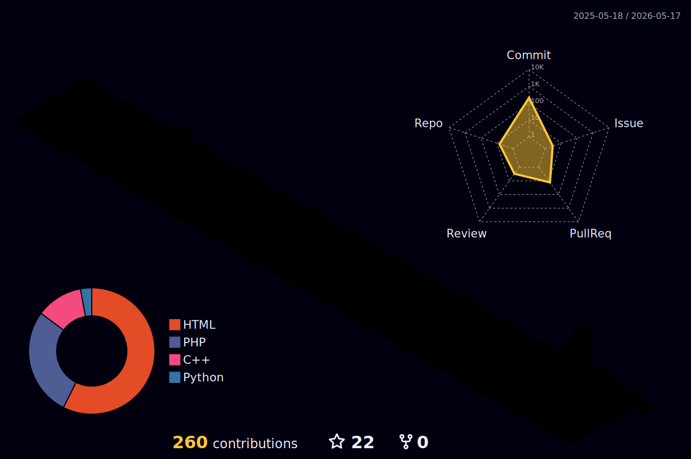

<p align="center">
  
</p>

<div align="center">
  
  
</div>

<br/>

---

## 🧑‍💻 About Me

```yaml
name:        Ahmed Al-Aini
location:    Yemen 🇾🇪
education:   Information Systems Student
focus:       Backend Development & Systems Engineering
languages:   C++, PHP, Python, JavaScript
passion:     Building scalable, production-ready systems
looking_for: Open-source collaborations & internship opportunities
```

<br/>

---

## 🚀 Tech Stack

### 💻 Programming Languages


### 🌐 Frontend


### 🗄️ Database & Backend


### 🛠️ Tools & Platforms


<br/>

---

## 📊 GitHub Stats

<div align="center">
  
  
</div>

<div align="center">
  
</div>

<br/>

---

## 🏆 GitHub Trophies

<p align="center">
  <a href="https://github.com/Ahmed-Al-Aini">
    <!-- صورة أنيميشن الثعبان ستظهر هنا -->
    
  </a>
</p>


<!-- 
<div align="center">
  <!-- صورة الإحصائيات الشاملة (Metrics) ستظهر هنا -->
  
</div> -->

<p align="center">
  
</p>

<br/>

---

## 📦 Core Projects

<table width="100%">
  <tr>
    <td valign="top">
      <h3>🏥 <a href="https://github.com/Ahmed-Al-Aini/Hospital-Management-System">Hospital Management System</a></h3>
      <p><strong>Production-ready web platform</strong> for hospital operations — patients, appointments, billing, and staff dashboard.</p>
      <p>
        
        
        
      </p>
      <ul>
        <li>👨‍⚕️ Full CRUD patient registry with medical history</li>
        <li>📅 Appointment engine with conflict detection</li>
        <li>💰 Invoice generation & payment tracking</li>
        <li>🔐 Role-based access (Admin/Receptionist/Doctor)</li>
      </ul>
      <a href="https://github.com/Ahmed-Al-Aini/Hospital-Management-System">
        
      </a>
    </td>
  </tr>
  <tr>
    <td valign="top">
      <h3>💳 <a href="https://github.com/Ahmed-Al-Aini/Banking-system">Core Banking System (CLI)</a></h3>
      <p><strong>Enterprise-grade banking simulation</strong> — pure C++ with CSV persistence, OOP architecture, and transaction integrity.</p>
      <p>
        
        
        
      </p>
      <ul>
        <li>🔐 User authentication (customers + admin)</li>
        <li>💸 Fund transfers between accounts</li>
        <li>📊 Transaction history with timestamps</li>
        <li>👑 Admin controls: user management & system logs</li>
      </ul>
      <a href="https://github.com/Ahmed-Al-Aini/Banking-system">
        
      </a>
    </td>
  </tr>
  <tr>
    <td valign="top">
      <h3>📝 <a href="https://github.com/Ahmed-Al-Aini/Data-Structure-Text-Editor">Data Structure Text Editor</a></h3>
      <p><strong>Low-level text processor</strong> demonstrating algorithmic efficiency using stacks and queues.</p>
      <p>
        
        
      </p>
      <ul>
        <li>↩️ Undo/Redo via stack implementation</li>
        <li>📦 Buffer management with queue data structures</li>
        <li>⚡ Memory-efficient string operations</li>
      </ul>
      <a href="https://github.com/Ahmed-Al-Aini/Data-Structure-Text-Editor">
        
      </a>
    </td>
  </tr>
  <tr>
    <td valign="top">
      <h3>🔍 More Projects</h3>
      <p>Explore all my repositories for additional C++, PHP, and Python projects covering algorithms, utilities, and web applications.</p>
      <p>
        
        
        
      </p>
      <ul>
        <li>📂 Algorithms & data structures in C++</li>
        <li>🌐 PHP web applications & utilities</li>
        <li>🐍 Python automation scripts</li>
      </ul>
      <a href="https://github.com/Ahmed-Al-Aini?tab=repositories">
        
      </a>
    </td>
  </tr>
</table>

<br/>

---

## 📈 Contribution Activity

<div align="center">
  
</div>

<br/>

---

## 🌐 3D Contribution Globe

<p align="center">
  <picture>
    <source media="(prefers-color-scheme: dark)" srcset="./profile-3d-contrib/profile-night-rainbow.svg" />
    <source media="(prefers-color-scheme: light)" srcset="./profile-3d-contrib/profile-light-rainbow.svg" />
    
  </picture>
</p>

---

## 🤝 Connect & Collaborate

<p align="center">I'm actively seeking <strong>open-source collaborations</strong> and <strong>internship opportunities</strong> in backend development and systems engineering.</p>

<div align="center">

[](mailto:25160091@su.edu.ye)
&nbsp;
[](https://github.com/Ahmed-Al-Aini)

<br/>

[](https://github.com/Ahmed-Al-Aini/Ahmed-Al-Aini/actions/workflows/profile3d.yml)

</div>

<br/>

---

<!-- my-badges start -->
<a href="my-badges/public-keys-1.md"></a>
<!-- my-badges end -->

<br/>


